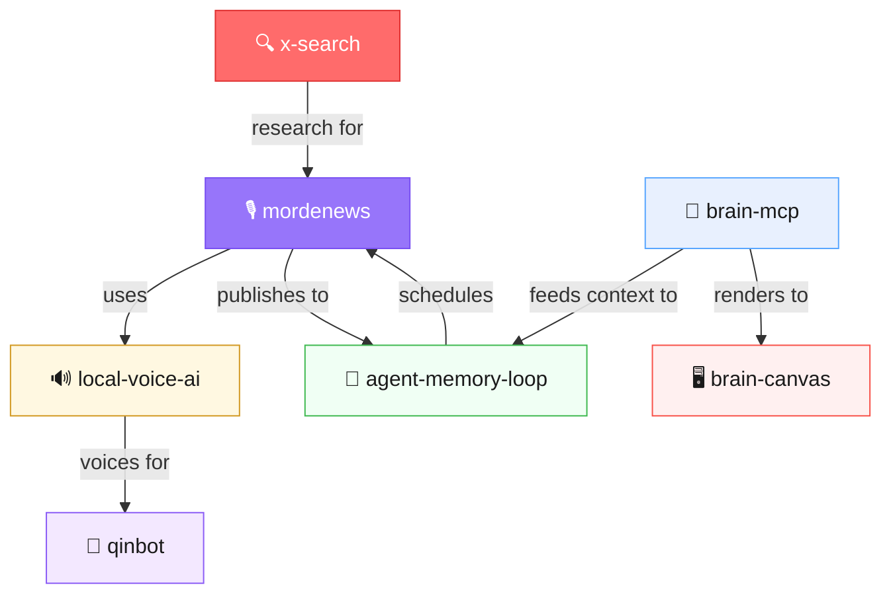

# 🎙️ MordeNews

**Automated daily podcast from YouTube channels. Zero human involvement.**

<p align="center">
  
</p>

<p align="center"><i>⬆️ Auto-playing preview — <a href="https://github.com/user-attachments/assets/1d70a09b-cd07-4aa7-ac79-b98df438deda">click here for full video with audio</a></i></p>

Every morning at 6am, this pipeline wakes up, downloads the latest videos from 21 AI/tech YouTube channels, transcribes them locally, summarizes with Gemini, speaks the summaries with neural TTS, stitches everything into a two-host daily podcast, and publishes it. You wake up, the podcast is ready.

No cloud GPUs. No paid transcription APIs. Runs on a Mac Mini M4. **~$0.01/day in API costs.**

---

## Architecture


## ✨ Features

- **21 YouTube channels** monitored daily (AI Explained, Fireship, Lex Fridman, Dwarkesh Patel, etc.)
- **Local speech-to-text** — Parakeet MLX runs on Apple Silicon, no API calls
- **Gemini Flash summarization** — each video condensed into a 3-minute audio briefing
- **Local text-to-speech** — Kokoro MLX generates natural-sounding audio on-device
- **Two-host podcast format** — Alex (male) and Sarah (female) discuss the day's top 5 stories
- **Auto-publish** — uploads to Supabase Storage, creates news entry, notifies Discord
- **Deduplication** — tracks processed videos, never re-processes
- **Fault-tolerant** — fallbacks at every stage (Parakeet → Whisper, Gemini → extractive summary)

## 🔧 How It Works

The pipeline runs in 6 stages:

| Stage | Script | What It Does |
|-------|--------|-------------|
| **1. Fetch** | `fetch_podcasts.sh` | Uses `yt-dlp` to grab latest videos from configured channels |
| **2. Download** | `full_pipeline.py` | Downloads audio as MP3 (quality 5, small files) |
| **3. Transcribe** | `full_pipeline.py` | Runs `parakeet-mlx` locally — ~3 seconds per minute of audio |
| **4. Summarize** | `summarize_and_speak.py` | Sends transcript to Gemini Flash, gets a 400-word conversational summary |
| **5. Speak** | `daily_supercut.py` | Generates a two-host podcast script via Gemini, then TTS each segment with Kokoro |
| **6. Publish** | `publish_podcast.py` | Uploads MP3 to Supabase Storage, creates news entry, posts to Discord |

The main orchestrator is `full_pipeline.py`, which handles stages 1–4 per-video. Then `daily_supercut.py` takes all the day's transcripts and creates the final podcast. Finally `publish_podcast.py` ships it.

## 📦 Installation

### Prerequisites

- **macOS with Apple Silicon** (M1/M2/M3/M4) — required for MLX-based models
- **Python 3.10+**
- **Homebrew** (for ffmpeg, yt-dlp)

### 1. Clone & Install

```bash
git clone https://github.com/mordechaipotash/mordenews.git
cd mordenews

# Install Python dependencies
pip install -r requirements.txt

# Install system dependencies
brew install ffmpeg yt-dlp
```

### 2. Install MLX Models

```bash
# Speech-to-text (Parakeet MLX)
pip install parakeet-mlx

# Text-to-speech (Kokoro MLX)
pip install kokoro-mlx
```

### 3. Configure

```bash
# Copy example config
cp config.example.json config.json

# Set environment variables
export GEMINI_API_KEY="your-gemini-api-key"
export SUPABASE_URL="https://your-project.supabase.co"
export SUPABASE_KEY="your-anon-key"

# Optional: Discord webhook for notifications
export DISCORD_WEBHOOK_URL="https://discord.com/api/webhooks/..."
```

### 4. Test Run

```bash
# Run the full pipeline once
python full_pipeline.py

# Generate today's podcast
python daily_supercut.py

# Publish
python publish_podcast.py
```

## ⚙️ Configuration

### `config.json`

```json
{
  "channels": {
    "Channel Name": "YouTube_Channel_ID"
  },
  "maxVideosPerChannel": 3,
  "lookbackDays": 1,
  "audioQuality": 5,
  "whisperModel": "tiny.en"
}
```

**Finding a Channel ID:** Go to a YouTube channel → View Page Source → search for `channelId` or `externalId`. It looks like `UCxxxxxxxxxxxxxxxxxxxxxx`.

### Environment Variables

| Variable | Required | Description |
|----------|----------|-------------|
| `GEMINI_API_KEY` | Yes | Google Gemini API key (for summarization) |
| `SUPABASE_URL` | For publishing | Your Supabase project URL |
| `SUPABASE_KEY` | For publishing | Your Supabase anon/service key |
| `DISCORD_WEBHOOK_URL` | No | Discord webhook for notifications |
| `KOKORO_VOICE_ALEX` | No | TTS voice for host Alex (default: `am_michael`) |
| `KOKORO_VOICE_SARAH` | No | TTS voice for host Sarah (default: `af_heart`) |
| `PARAKEET_CMD` | No | Path to parakeet-mlx binary (auto-detected) |
| `KOKORO_CMD` | No | Path to kokoro-mlx binary (auto-detected) |
| `DATA_DIR` | No | Where to store audio/transcripts/output (default: `./data`) |

## ⏰ Cron Setup

Run the full pipeline every morning at 6am:

```bash
# Edit crontab
crontab -e

# Add this line (adjust paths)
0 6 * * * cd /path/to/mordenews && python full_pipeline.py >> /tmp/mordenews.log 2>&1 && python daily_supercut.py >> /tmp/mordenews.log 2>&1 && python publish_podcast.py >> /tmp/mordenews.log 2>&1
```

Or use the provided run script:

```bash
0 6 * * * /path/to/mordenews/run_daily.sh >> /tmp/mordenews.log 2>&1
```

## 💰 Cost

| Component | Cost | Runs On |
|-----------|------|---------|
| Speech-to-Text (Parakeet MLX) | **$0** | Local — Apple Silicon |
| Text-to-Speech (Kokoro MLX) | **$0** | Local — Apple Silicon |
| Summarization (Gemini Flash) | **~$0.01/day** | Google API (free tier covers most usage) |
| YouTube Download (yt-dlp) | **$0** | Local |
| Audio Processing (ffmpeg) | **$0** | Local |
| **Total** | **~$0.01/day** | Mac Mini M4 |

Most people use cloud APIs for everything — Whisper API ($0.006/min), ElevenLabs ($5-22/mo), cloud GPUs. This runs entirely on Apple Silicon. Local STT, local TTS, only Gemini for the summarization step.

## 🎧 Output

The pipeline produces:

- **Individual summaries** — 3-minute audio briefings per video (WAV)
- **Daily supercut** — ~20-minute two-host podcast (MP3)
- **Transcript files** — full text of every video processed
- **Summary text** — written summaries for each video

All stored in `data/`:
```
data/
├── audio/           # Downloaded MP3s from YouTube
├── transcripts/     # Full transcription text files
├── summaries/       # Written summaries + individual TTS audio
├── supercuts/       # Daily podcast MP3s + scripts
└── processed.json   # Deduplication tracker
```

## 🎧 Listen to a Real Episode

These are actual episodes generated by the pipeline:

- [March 1, 2026](https://xsjyfneizfkbitmzbrta.supabase.co/storage/v1/object/public/podcast-audio/daily_2026-03-01.mp3) — Today's episode
- [February 27, 2026](https://xsjyfneizfkbitmzbrta.supabase.co/storage/v1/object/public/podcast-audio/daily_2026-02-27.mp3)
- [February 26, 2026](https://xsjyfneizfkbitmzbrta.supabase.co/storage/v1/object/public/podcast-audio/daily_2026-02-26.mp3)
- [February 25, 2026](https://xsjyfneizfkbitmzbrta.supabase.co/storage/v1/object/public/podcast-audio/daily_2026-02-25.mp3)

*New episode every morning at 6am Israel time. Fully automated.*

## 🏗️ Project Structure

```
mordenews/
├── full_pipeline.py         # Main orchestrator — download, transcribe, summarize
├── daily_supercut.py        # Two-host podcast generator
├── summarize_and_speak.py   # Gemini summarization + Kokoro TTS
├── publish_podcast.py       # Upload to Supabase + notify Discord
├── podcast_pipeline.py      # Lightweight pipeline (download + transcribe only)
├── fetch_podcasts.sh        # Shell-based fetcher (alternative to Python)
├── run_daily.sh             # Cron wrapper script
├── config.json              # Your channel configuration
├── config.example.json      # Example configuration
├── requirements.txt         # Python dependencies
└── data/                    # All generated content (gitignored)
```

## 🤔 Why?

I wanted a daily AI news podcast that:
1. Covers the channels I actually watch
2. Doesn't cost $50/month in API fees
3. Runs without me thinking about it
4. Actually sounds decent

Cloud APIs would cost ~$30-50/day for this workload. Apple Silicon MLX models do the heavy lifting for free. The only API call is Gemini Flash for summarization (~$0.01/day on the free tier).

The result: a fully automated, daily podcast that runs on a Mac Mini sitting under my desk. Every morning at 6am, it wakes up, does its thing, and by the time I'm drinking coffee, there's a fresh 20-minute podcast waiting.

## 🔗 Part of the AI Agent Ecosystem

MordeNews is one piece of a larger system — an AI agent stack that handles memory, voice, maintenance, and content generation autonomously.



| Repo | What | Stars |
|------|------|-------|
| [brain-mcp](https://github.com/mordechaipotash/brain-mcp) | Memory — 25 MCP tools, cognitive prosthetic | ⭐ 17 |
| [brain-canvas](https://github.com/mordechaipotash/brain-canvas) | Visual display for any LLM | ⭐ 11 |
| [local-voice-ai](https://github.com/mordechaipotash/local-voice-ai) | Voice — Kokoro TTS + Parakeet STT, zero cloud | ⭐ 1 |
| [agent-memory-loop](https://github.com/mordechaipotash/agent-memory-loop) | Maintenance — cron, context windows, STATE.json | ⭐ 1 |
| [x-search](https://github.com/mordechaipotash/x-search) | Search X/Twitter via Grok, no API key | 🆕 |
| **[mordenews](https://github.com/mordechaipotash/mordenews)** | **This repo** — automated daily podcast | 🆕 |
| [qinbot](https://github.com/mordechaipotash/qinbot) | AI on a dumb phone — no browser, no apps | ⭐ 1 |

## 📄 License

MIT — Mordechai Potash


---

## How This Was Built

Built by [Steve [AI]](https://github.com/mordechaipotash), Mordechai Potash's agent. 100% machine execution, 100% human accountability.

> The conductor takes the bow AND the blame. [How We Work →](https://github.com/mordechaipotash/mordechaipotash/blob/main/HOW-WE-WORK.md)
